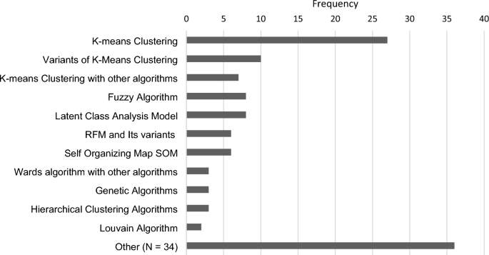
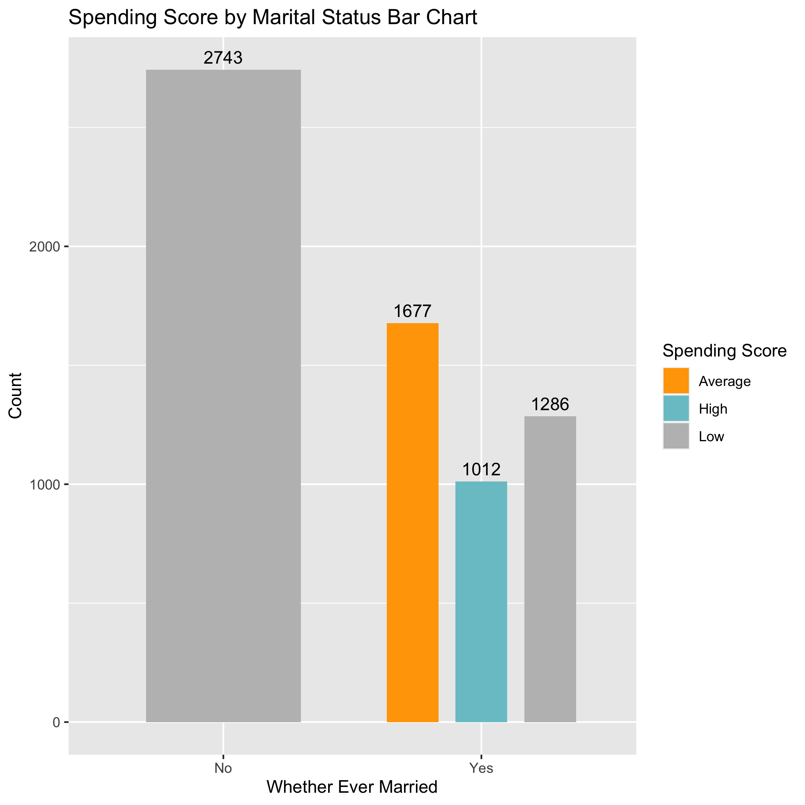
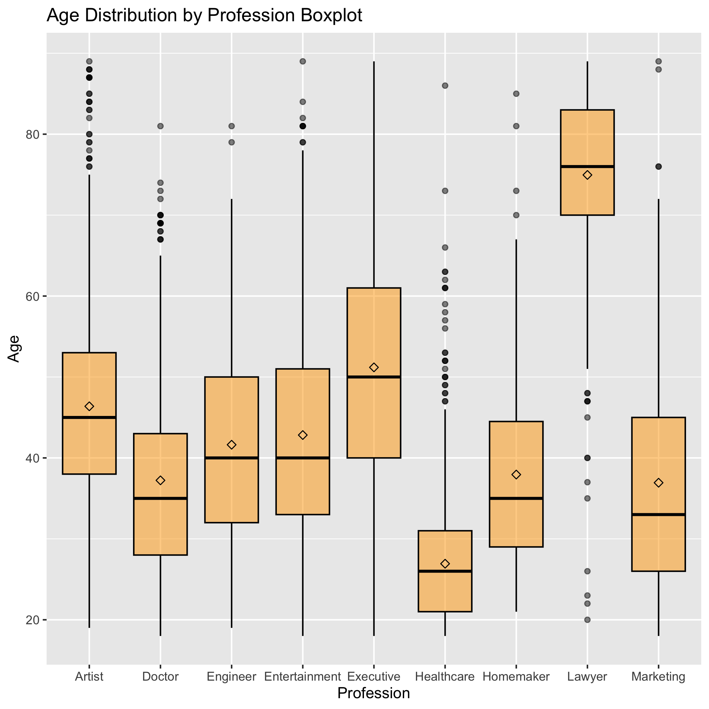
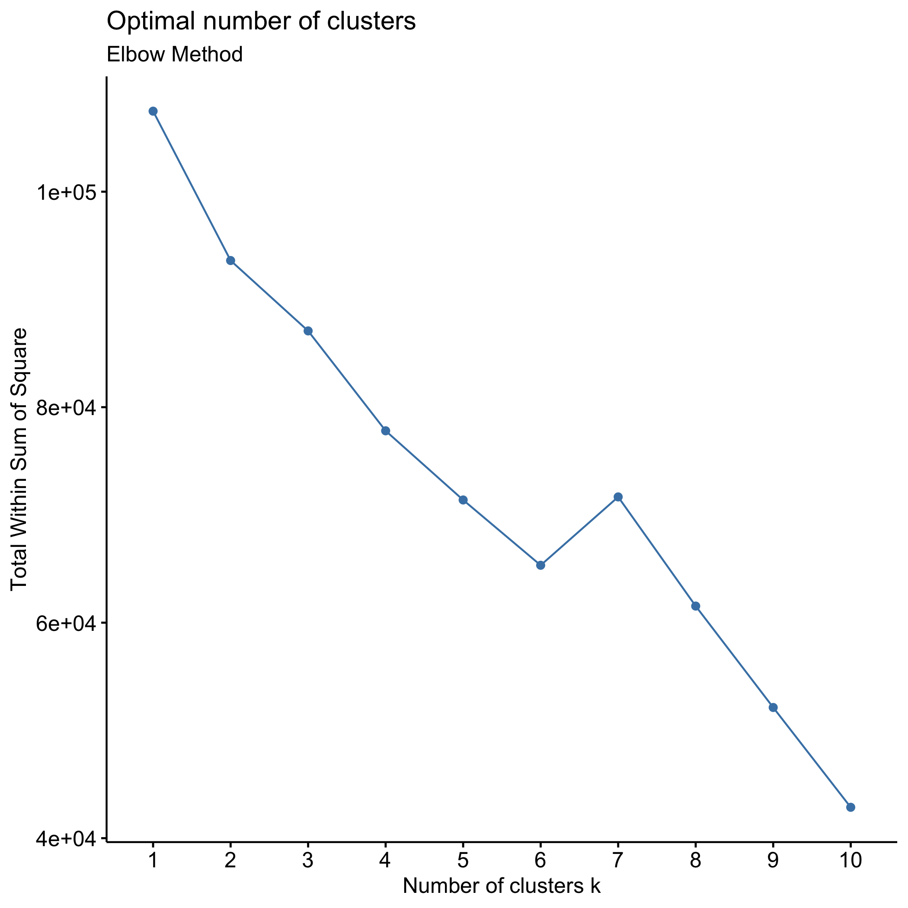
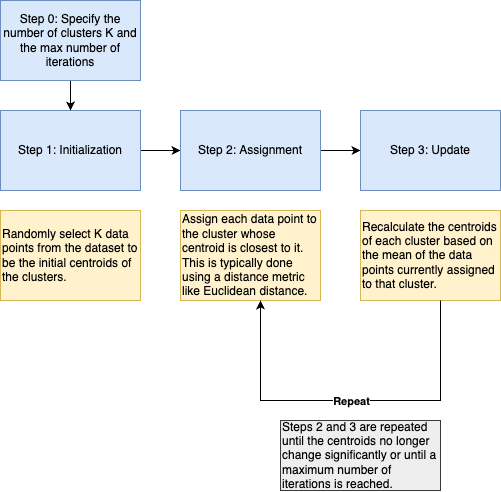
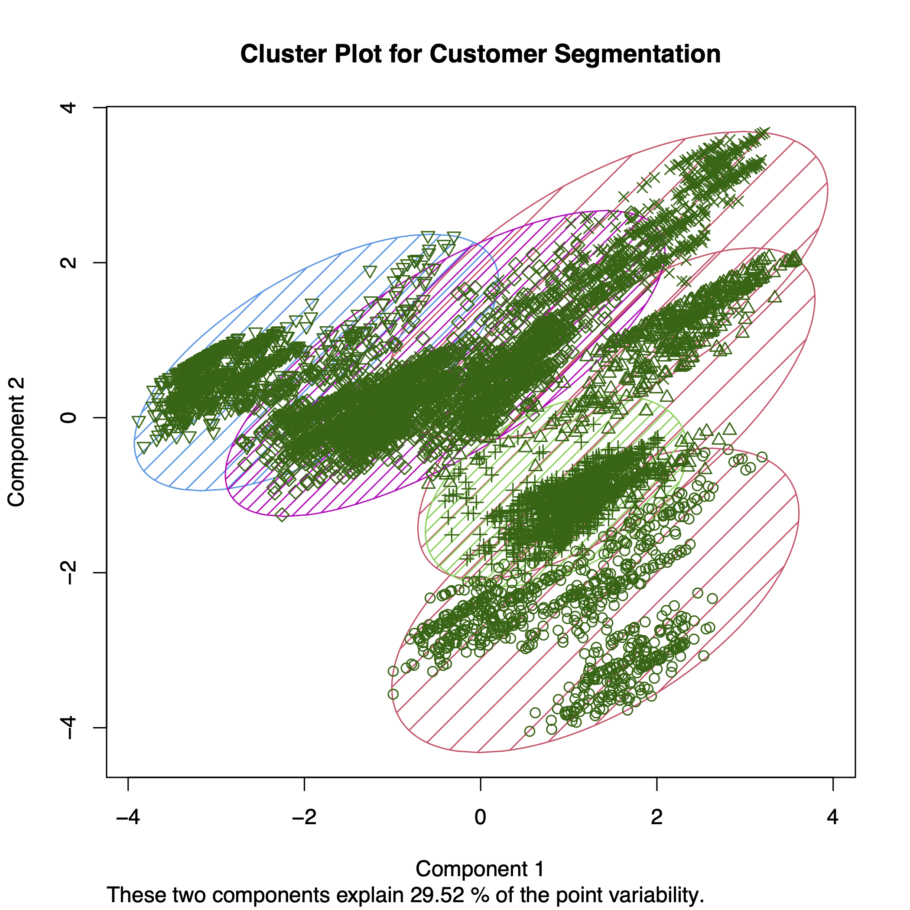

```{r setup, include=FALSE}
knitr::opts_chunk$set(echo = FALSE)
library(knitr)
library(kableExtra)
library(tidyverse)
```

## Summary 

Customer segmentation involves dividing customers into groups that share similar characteristics. The main objective of customer segmentation is to strategize how to engage with customers in each category, ultimately maximizing the profitability of the business from each customer [@su14127243].

In a 2023 research, a thorough overview of the ACS literature was conducted and `K-means clustering` was identified as the most frequently used algorithm for customer segmentation [@Salminen_Mustak_Sufyan_Jansen_2023]. Other popular algorithms including variations of `K-means clustering`, `K-means with other algorithms`, `Fuzzy Algorithm` and `Latent Class Analysis Model`[@Salminen_Mustak_Sufyan_Jansen_2023]. 

This figure shows the popularity rank of algorithms for customer segmentation from the same research.: 
```{r research, fig.align = 'center', echo=FALSE, fig.cap="Figure 1. Popular Algorithms for Customer Segmentation", out.width = '80%'}

```

In this project, I implemented K-means clustering in R [@R] and drew an elbow plot to identify the number of cluster `K` using the `factoextra` package [@factoextra]. Lastly, I visualized the clusters in a 2-D cluster plot using `clusplot()` in the `cluster` library [@cluster].

## Methods

### Data Collection and Pre-processing

The data set used in this project was a subset of the `Customer Segmentation` for an automobile company on kaggle.com and available [here](https://www.kaggle.com/datasets/vetrirah/customer). Each row of the data represents a used customer and his/her gender, martial information, age, graduation status, profession, work experience, spending score and family size. 

To clean the data for EDA, I manipulated the data using `tidyverse` [@tidyverse]. After, removing all the NAs, 6,718 rows of non-null data remained.

To preprocess the data for implementing the K-means clustering model, I created dummy variables using `fastDummies` for categorical features, as the algorithm does not take in categorical data [@fastDummies]. Then, I scaled the data using the `scale()` function in base R [@R]. By default, it returns scaled data with zero mean and unit variance. Here is the formula for a scaled value:

`scaled_value = (original_value - mean) / standard_deviation`

Scaling the data is important for K-means clustering because the algorithm calculates distances between data points to form clusters. When features have different scales, those with larger values can dominate the distance calculation, leading to biased cluster assignments. Scaling ensures that all features contribute equally to the clustering process, resulting in more meaningful and balanced clusters. Additionally, scaling helps K-means converge faster and prevents numerical instability during the optimization process.

### Exploratory Data Analysis (EDA)

To conduct exploratory data analysis, I visualized the data using `ggplot2` [@ggplot2]. The full EDA report can be viewd [here](Customer_Segmentation_EDA_Report.pdf)

According to Figure 2, unmarried customers consistently show a low spending score, while married customers display a broader range of spending scores, encompassing high, low, and average levels of spending. 

```{r marital, fig.align = 'center', echo=FALSE, fig.cap="Figure 2. Spending Score by Marital Status", out.width = '40%'}

```

According to Figure 3, the boxplot reveals that a significant portion of healthcare, medical (doctor), and marketing professionals in the dataset are relatively young (below 40 years old). On the other hand, law professionals tend to be relatively older (above 60 years old).

```{r profession, fig.align = 'center', echo=FALSE, fig.cap="Figure 3. Used Car Prices by Brands", out.width = '50%'}

```

### K-means Clustering Algorithm

K-means clustering is a popular unsupervised machine learning algorithm used for clustering data points into K distinct clusters based on their similarity. It aims to partition the data into clusters in a way that minimizes the sum of squared distances between data points and their respective cluster centroids. 

One of the most important hyper-parameters for K-means is the number of clusters K. The standard literature utilizes the elbow method to optimize K [@patankar2021customer]. 

The elbow method is a technique used to determine the optimal number of clusters, K, in K-means clustering. It involves plotting the sum of squared distances (SSD) between data points and their assigned cluster centroids for different values of K. As K increases, the SSD typically decreases, as each data point is closer to its cluster centroid. However, beyond a certain point, adding more clusters does not lead to a significant reduction in SSD, and the curve in the plot starts to level off, resembling an elbow. The optimal number of clusters is usually identified at this point, as it represents the "elbow" or the point of diminishing returns. The K value corresponding to the elbow is considered the optimal choice for balancing the trade-off between model complexity and clustering performance, leading to more meaningful and interpretable clusters.

According to the elbow plot for this project shown below, I chose 6 as the number of clusters (K) because when K = 7, the SSD does not decrease significantly, and instead, it increases. 

I initially set the maximum number of iterations to 10 give the relatively small data size to see if any meaningful results could be generated for this project.

```{r elbow, fig.align = 'center', echo=FALSE, fig.cap="Figure 4. The Elbow Method", out.width = '50%'}

```

The K-means clustering algorithm starts by randomly selecting K data points from the dataset as initial cluster centroids. It then iteratively assigns each data point to the cluster with the closest centroid, using a distance metric like Euclidean distance. After the assignment, the centroids are updated by calculating the mean of the data points currently assigned to each cluster. This process is repeated until the centroids no longer change significantly or until a maximum number of iterations is reached. The algorithm converges when the centroids stabilize, and data points are assigned to the closest clusters based on these final centroids. The flowchart below illustrates how K-means Clustering Algorithms work step by step: 
```{r kmeans, fig.align = 'center', echo=FALSE, fig.cap="Figure 5. Kmeans Clustering Algorithm Steps", out.width = '50%'}

```

## Results & Discussion

I trained the K-means clustering model with the number of clusters K = 6 and the maximum number of iteration of 10. The below cluster plot demonstrates two major components that explain the clusters.

```{r cluster_plot, fig.align = 'center', echo=FALSE, fig.cap="Figure 6. 2-D Cluster Plot", out.width = '50%'}

```

Each customer is assigned a cluster and the results are saved in the `results` folder.  Here is a snippet of the cluster assignment: 

```{r cluster_assignment, echo=FALSE}
cluster_assignment = read_csv('../results/clusters.csv', show_col_types = FALSE)
snippet <- head(cluster_assignment)
snippet_part1 <- snippet[,1:8]
snippet_part2 <- snippet[,9:14]
snippet_part3 <- snippet[,15:17]

# Display snippet_part1
kable(snippet_part1) |> 
  kable_styling(position = "center")

# Display snippet_part2
kable(snippet_part2) |> 
  kable_styling(position = "center")

# Display snippet_part3
kable(snippet_part3) |> 
  kable_styling(position = "center")
```
# References
